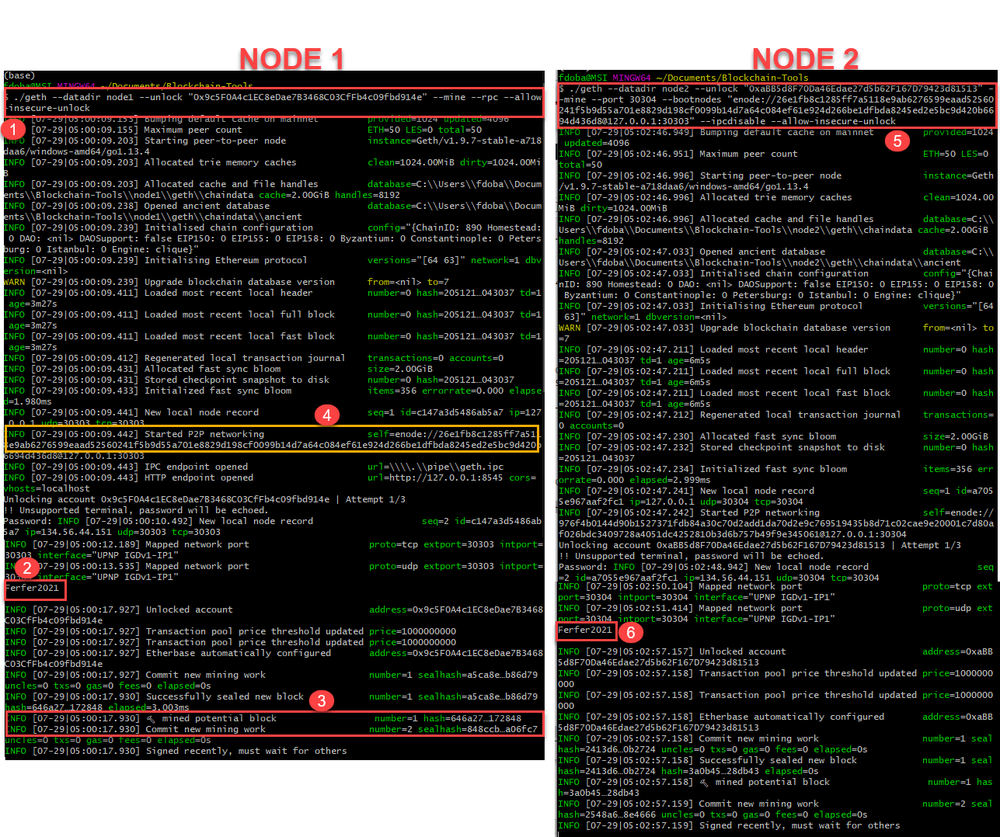

# Proof of Authority Development Chain

At the end of theses steps, you'll have a testnet blockchain set up. The objectives are ;

* Set up your custom testnet blockchain.
* Send a test transaction.

#### In order to set up a testnet, you will need to use the following skills/tools we learned in class:
#### Puppeth, to generate your genesis block.
#### Geth, a command-line tool, to create keys, initialize nodes, and connect the nodes together.


Requirements:

* MyCrpyto (https://download.mycrypto.com/)
* Go Etherum (https://geth.ethereum.org/)


# Instructions:


### Create accounts for two (or more) nodes for the network with a separate datadir for each using geth.

1) Run the command below to create the Node1

```sh
./geth --datadir node1 account new
```
2) Set the password for the Node1 Account
   * Do not forget to copy the public address of the key

3) Run the command below to create the Node2
```sh
./geth --datadir node2 account new
```
4) Set up the password for the Node2 Account
   * Do not forget to copy the public address of the key


1) Copy the both "Public address of key" and save it for later


### Run puppeth, name your network, and select the option to configure a new genesis block.
```sh
./puppeth
```

2) Name your network
3) Choose option 2 ( Configure new genesis)
4) Choose option 1 ( Create new genesis from scratch)
5) Choose the Clique (Proof of Authority) consensus algorithm.
6) Set the 15 seconds 
7) Paste both account addresses from the first step one at a time into the list of accounts to seal.
8) Paste them again in the list of accounts to pre-fund. There are no block rewards in PoA, so you'll need to pre-fund.
9) Type "yes"
10) Set the CHAIN/NETWORK ID
    *** This information you will need to create the custom network in MyCrypto app, it will link the genesis with the network that will be created ***

Once you complete the creation, follow the next steps:

11) Choose the option 2 ( Manage existing genesis)
12) Choose the option 2 ( Export genesis configuration)
   * This will fail to create two of the files, but you only need networkname.json.
   * You can delete the networkname-harmony.json file.
 


### Initialize each node with the new networkname.json with geth.

```sh
./geth --datadir node1 init bcnet.json
./geth --datadir node2 init bcnet.json
```

1) Run the command above to initialize the node 1 and 2
   * If everything is ok, you'll see the "Successfully wrote genesis state"

   


### Run the first node, unlock the account, enable mining, and the RPC flag. Only one node needs RPC enabled.

```sh
./geth --datadir node1 --unlock "0x9c5F0A4c1EC8eDae7B3468C03CfFb4c09fbd914e" --mine --rpc --allow-insecure-unlock
```
* The command above is very important, because it will start the node to begin mining blocks and also links the account. 


1) Running the command above, you'll need to set the node account (Public address of the key) created in the first steps
2) it will ask for your password, but it will still loading some commands. Wait for few seconds and type your password for the node1 account created in the first steps
     * If everything is ok, you'll see a message right after "Unlocked account"
3) The message you'll confirm that you're all set
4) Scroll up and find the line "Started P2P Networking", it's the Node1 address. Copy the address as an example shown below:
    * enode://26e1fb8c1285ff7a5118e9ab6276599eaad52560241f5b9d55a701e8829d198cf0099b14d7a64c084ef61e924d266be1dfbda8245ed2e5bc9d420b6694d436d8@127.0.0.1:30303
    
##### Open a new terminal window and move to the step 5

5) Run the command below adding the the ENODE address copied from the previous step.
   * Set a different peer port for the second node and use the first node's enode address as the bootnode flag.
   * As suggested, the port set up is 30304.
```sh
./geth --datadir node2 --unlock "0xaBB5d8F70Da46Edae27d5b62F167D79423d81513" --mine --port 30304 --bootnodes "enode://26e1fb8c1285ff7a5118e9ab6276599eaad52560241f5b9d55a701e8829d198cf0099b14d7a64c084ef61e924d266be1dfbda8245ed2e5bc9d420b6694d436d8@127.0.0.1:30303" --ipcdisable --allow-insecure-unlock
```

* If you're running on Windows, you'll need to add the parameter --ipcdisable to be allowed in the firewall
* It's already included in the previous command as I'm running on Windows.

6) The password will be needed for the Node2 Account. Wait few seconds after complete all the loading, type the password and press enter


   

### You will need to use a custom network, and include the chain ID, and use ETH as the currency. Follow the steps below to create a custom node

1) Click in "Add Custom Node"
2) Set up with all the information as shown. \
      * You can name the node and network as you wish
      * Set the Network as "Custom"
      * Currency should be ETH
      * URL you can set as shown ( Replace the "https" to "http")
3) The Chain id is really important, it will link your genesis created before with the network. After you set up it, click in Save & Use Custom Node

   

### Import the keystore file from the node1/keystore directory into MyCrypto. This will import the private key.

1) Select the network created in the previous step
2) Click in Keystore File

   

1) Click in Select Wallet File
2) It will pop up a window for locate the file
3) The file will be located inside of the Node's folder/keystore
4) After selected the file, click in open

   


         
### Send a transaction from the node1 account to the node2 account.

   

### Transaction shown in the node:

   

### Copy the transaction hash and paste it into the "TX Status" section of the app, or click "TX Status" in the popup.

   

